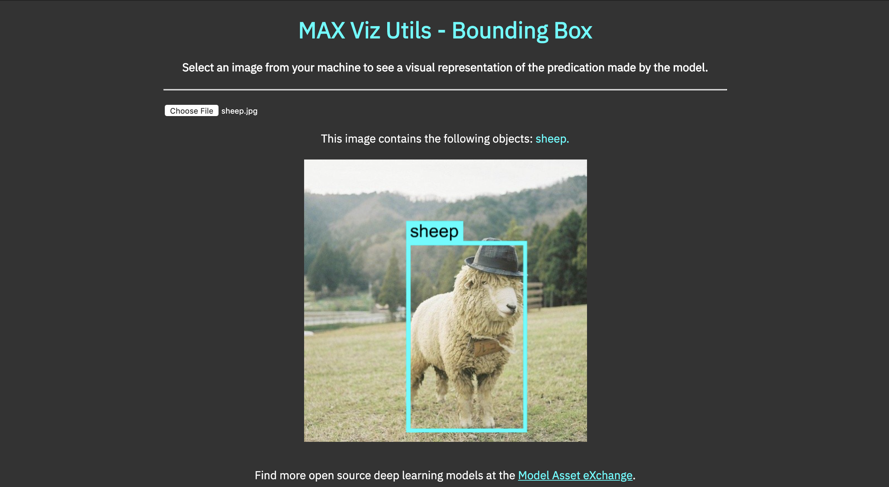

# max-viz-utils

This package will allow you to quickly and easily create annotated images from predictions generated by the deep learning models of the Model Asset eXchange (MAX) in your JavaScript applications.

Currently the list of supported models includes:
- `MAX Image Segmenter`
- `MAX Human Pose Estimator`
- `MAX Object Detector`
- `MAX Facial Recognizer`
- `MAX Facial Age Estimator`
- `MAX Facial Emotion Classifier`



## Getting Started

To use these functions in a web app, you can import the library by inserting the following line into your HTML:
``` html
<script src="https://cdn.jsdelivr.net/npm/max-viz-utils@0.0.40"></script>
```
After this resource has been loaded, you can access all of the functions on the `maxVizUtils` object.  

For example: 
``` js
// get model response...
const prediction = await response.json()
const objectBoxes = await maxVizUtils.getObjectBoxes(imageData, prediction.predictions, vizOptions)  
```

Alternatively, you can install this library in a Node.js project with NPM, using the following command:
``` bash
$ npm install max-viz-utils
```

## Uses

### MAX Image Segmenter
#### `getColorMap(imageData, segmentMap, options)`
   - this function takes an image and the corresponding segment map contained in the model payload, and returns the annotated colormap image.
   
#### Response Payload
- `blob` - a blob containing the annotated image output 
- `segments` - an array containing the name and color of each segment
- `width` - the width of the annotated image output
- `height` - the height of the annotated image output

#### Available Options: 
- (none)

<hr />

### MAX Human Pose Estimator
#### `getPoseLines(imageData, poseData, options)`
   - this function takes an image with the corresponding detected poses contained in the model payload and returns an annotated image with drawn pose lines.
   
#### Response Payload
- `blob` - a blob containing the annotated image output 
- `width` - the width of the annotated image output
- `height` - the height of the annotated image output

#### Available Options: 
- `lineColor`
- `linePad`

<hr />

### MAX Object & Facial Detector Models
#### `getObjectBoxes(imageData, boxData, options)`
   - this function takes an image and the corresponding detected objects contained in the model payload, and returns an annotated image with drawn bounding boxes.
   
#### Response Payload
- `blob` - a blob containing the annotated image output 
- `objects` - an array containing the name and color of each object box
- `width` - the width of the annotated image output
- `height` - the height of the annotated image output
   
#### Available Options: 
- `lineColor`
- `linePad`
- `fontColor`
- `fontSize`
- `modelType`   
   
 #### `cropObjectBoxes(imageData, boxData, options)`
   - this function takes an image and the corresponding detected objects contained in the model payload, and returns an array of cropped images with metadata.

#### Response Payload
- This function returns an array, with each element containing the following:
- `blob` - a blob containing the cropped object box image 
- `label` - the name of the cropped object
- `width` - the width of the cropped image output
- `height` - the height of the cropped image output

#### Available Options: 
- `lineColor`
- `linePad`
- `fontColor`
- `fontSize`
- `modelType`

<hr />

## Customizing the Annotations (Options)

These utility functions accept an optional third parameter called `options` that can handle the following values:
- `lineColor`: a string containing the name of any valid CSS color. Sets the color of annotations. 
  - default: cycles through different colors for each object.
- `linePad`: a number representing the thickness of lines in drawn annotations.
  - default: `1`
- `fontColor`: a string value, either `white` or `black` that sets the color of annotation text.
  - default: `black`
- `fontSize`: a number representing the size of the annotation text. Choose from `8`, `16`, `32`, `64`, `128`.
  - default: `32`
- `modelType`: a string containing the name of the type of MAX model. This is used to determine the structure of the model payload and build bounding boxes appropriately. Choose from `object-detector`, `facial-recognizer`, `facial-age-estimator`, `facial-emotion-classifier`
  - default: `object-detector`

## Examples

To see these functions in action, visit the following CodePen demos to see what they can do. Feel free to fork the pens for yourself and extend them with your own enhancements!

- [MAX Image Segmenter (TF.js)](https://codepen.io/kastentx/pen/OYvEeY)
- [MAX Human Pose Estimator (TF.js)](https://codepen.io/kastentx/pen/QRZWNV)
- [MAX Object Detector - Bounding Boxes](https://codepen.io/kastentx/pen/MdLMLG)
- [MAX Object Detector - Cropping Boxes](https://codepen.io/kastentx/pen/GaeayB)
